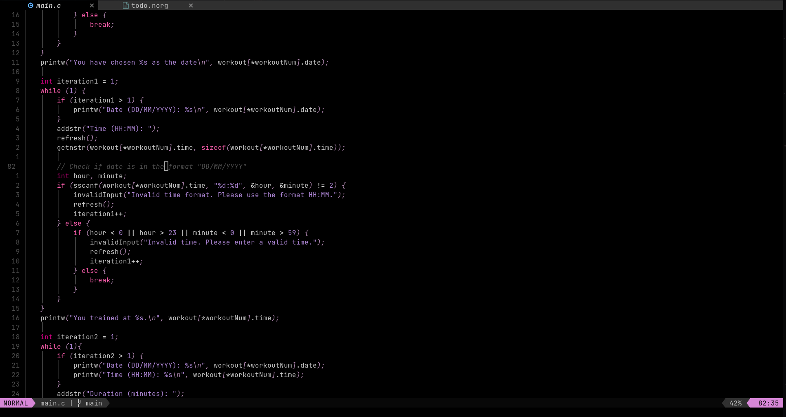

# Viola-vim

This is a fork from the [paramount][] colorschme for `vim` and `nvim`, it follows a purple color palette.  
It has more colors for keywords highlight, but not too much to make you dizzy.

[paramount]: https://github.com/owickstrom/vim-colors-paramount

## Installation

Use a plugins manager of your choice and just add this colorscheme to your config.

Using [packer.nvim][](this is what I use):

```lua
use {'ElPatatone/viola-vim'}
```

[packer.nvim]: https://github.com/junegunn/vim-plug

### Demo


